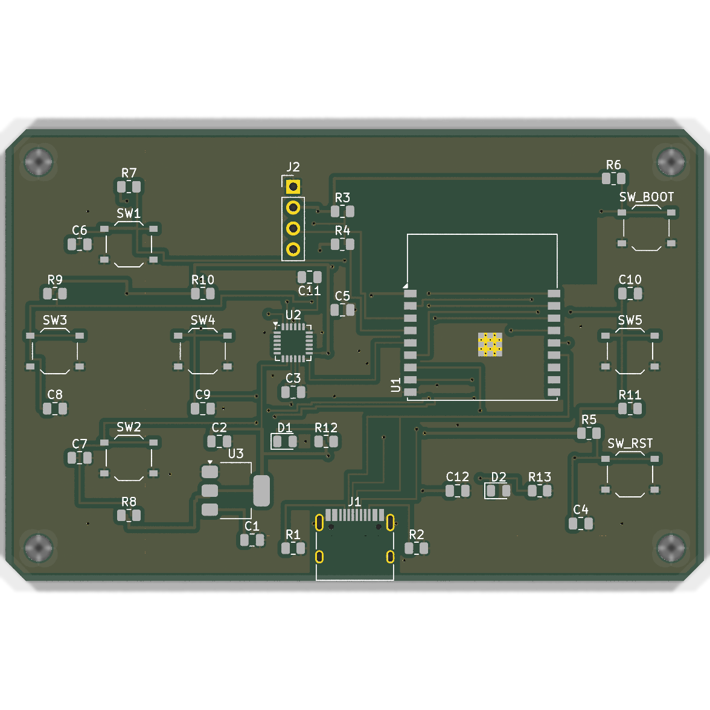
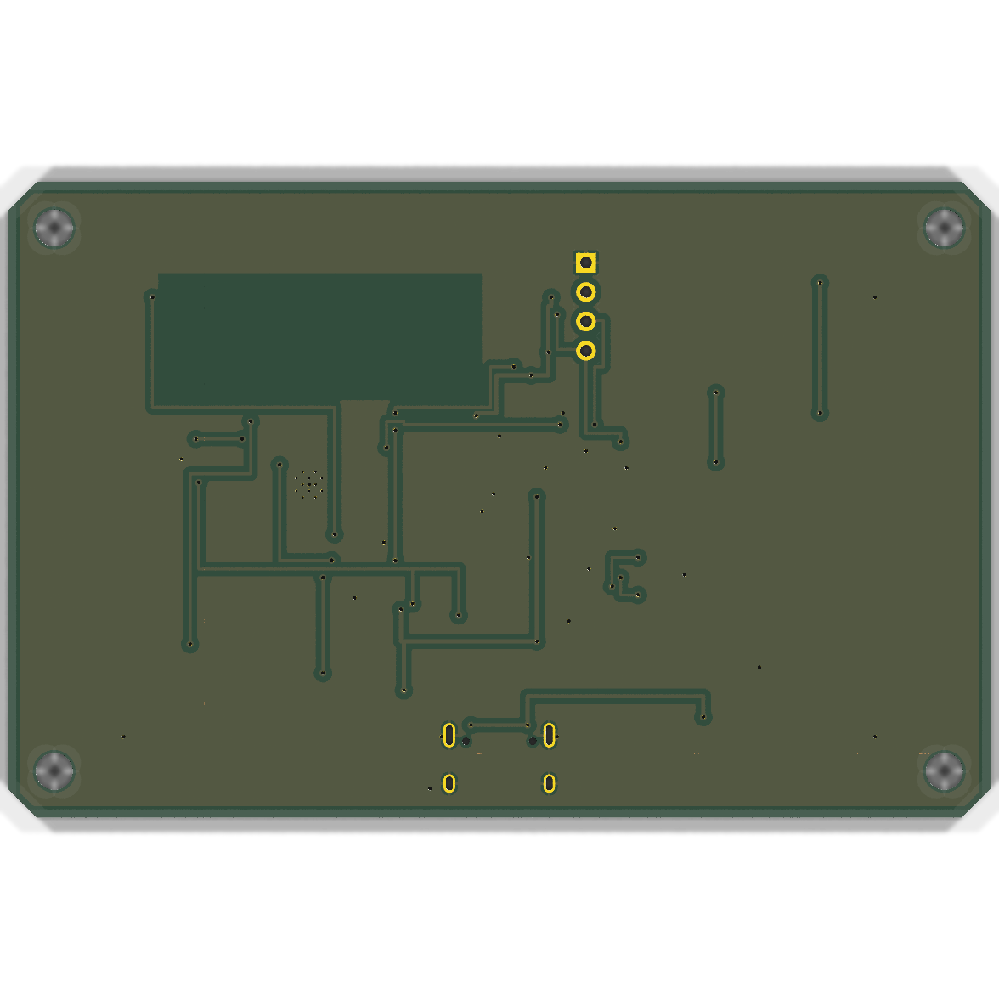

# ESP32-C3 Motion Controller & Gamepad

Compact 2-layer handheld motion controller and gamepad designed in KiCad 9 for JLCPCB manufacturing and SMT assembly.

---

## 1. Hardware Architecture

* **MCU**: Espressif ESP32-C3-WROOM-02-N4 (32-bit RISC-V @ 160 MHz, 4MB Flash, 2.4 GHz Wi-Fi 4 & Bluetooth 5 LE).
* **Display**: 0.96" 128×64 I2C OLED (SSD1306) on 1×04 2.54mm pin header.
* **IMU**: InvenSense MPU-6050 6-axis Gyroscope + Accelerometer (QFN-24) with hardware motion processing and interrupt output.
* **Navigation Inputs**: 5 tactile pushbuttons (`UP`, `DOWN`, `LEFT`, `RIGHT`, `SELECT`) with 10kΩ external pull-ups and 100nF debounce capacitors.
* **System Inputs**: Dedicated hardware `RESET` and `BOOT` tactile buttons.
* **Power Management**:
  * USB Type-C 16-pin connector with dual 5.1kΩ CC pull-down resistors (standard UFP / 5V 3A sinking).
  * AMS1117-3.3 SOT-223 Low-Dropout Regulator (800mA max output) with 10µF input/output decoupling.
  * Status indicator LED on +3.3V rail and programmable GPIO status LED.
* **Connectivity**: Native USB D+/D- directly routed with differential impedance matching to ESP32-C3 GPIO18/GPIO19 (USB CDC / JTAG).

---

## 2. Pinout Mapping

| Component | Signal | ESP32-C3 GPIO | Description |
| :--- | :--- | :--- | :--- |
| **I2C Bus** | `I2C_SDA` | GPIO4 | Shared SDA for SSD1306 & MPU-6050 (4.7kΩ pull-up) |
| | `I2C_SCL` | GPIO5 | Shared SCL for SSD1306 & MPU-6050 (4.7kΩ pull-up) |
| **MPU-6050** | `MPU_INT` | GPIO6 | Motion interrupt trigger |
| **Buttons** | `BTN_UP` | GPIO0 | Directional Up button (active low) |
| | `BTN_DOWN` | GPIO1 | Directional Down button (active low) |
| | `BTN_LEFT` | GPIO2 | Directional Left button (active low) |
| | `BTN_RIGHT` | GPIO3 | Directional Right button (active low) |
| | `BTN_SELECT` | GPIO7 | Action/Select button (active low) |
| **System** | `ESP_EN` | `CHIP_EN` | Hardware Reset with 10kΩ pull-up & 1µF RC delay |
| | `ESP_BOOT` | GPIO9 | Bootloader mode button (active low) |
| **Status** | `STATUS_LED` | GPIO10 | User programmable indicator LED |
| **USB Native**| `USB_D_N` | GPIO18 | USB Full-Speed D- |
| | `USB_D_P` | GPIO19 | USB Full-Speed D+ |

---

## 3. PCB & Manufacturing Specifications

* **Dimensions**: 85.0 mm × 55.0 mm (Credit card footprint).
* **Layer Count**: 2 Layers (Top: `F.Cu`, Bottom: `B.Cu`).
* **Substrate**: FR4, 1.6 mm thickness.
* **Copper Weight**: 1 oz (35 µm).
* **Surface Finish**: HASL with lead / ENIG compatible.
* **Trace Clearance**: Min 0.15 mm clearance, min 0.20 mm track width (0.35 mm for power nets).
* **Vias**: 0.60 mm diameter, 0.30 mm drill (JLCPCB standard capability).
* **Planes**: Solid GND copper flood on both `F.Cu` and `B.Cu` with stitching vias and RF keepout under the onboard PCB antenna.
* **DRC Verification**: **0 Errors, 0 Warnings, 0 Unconnected Items** via `kicad-cli pcb drc`.

---

## 4. Production Files (`jlcpcb_production/`)

Ready for 1-click ordering on JLCPCB:

* **Gerbers & Drill ZIP**: `esp32c3_controller_gerber_jlcpcb.zip`
* **Bill of Materials**: `esp32c3_controller_bom_jlcpcb.csv` (includes matched LCSC part numbers)
* **Centroid / Pick-and-Place**: `esp32c3_controller_cpl_jlcpcb.csv` (JLCPCB standard SMT column headers)
* **3D Photorealistic Previews**: `esp32c3_controller_render_top.png` and `esp32c3_controller_render_bottom.png`
