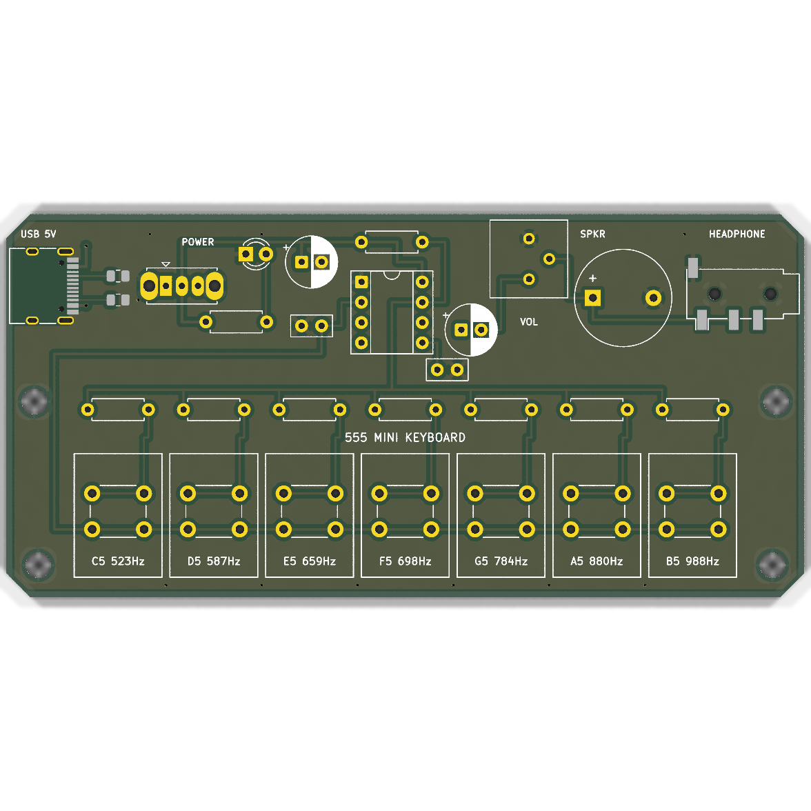
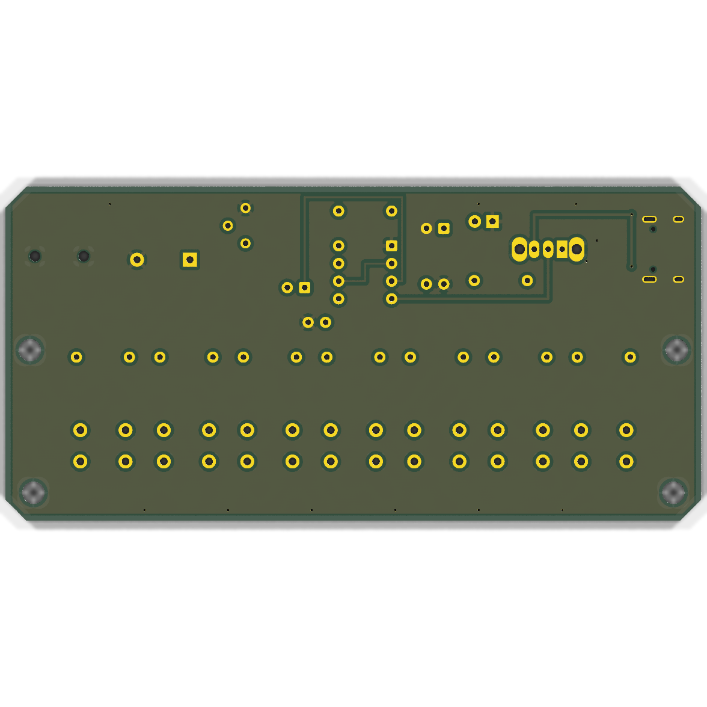

# 555 Mini Keyboard / Synthesizer Organ

A compact 7-note musical keyboard and synthesizer organ built around a single classic NE555 timer in an astable multivibrator configuration. Designed from schematic to 2-layer PCB fabrication in KiCad 9 with 100% production DRC/ERC pass (`--severity-all`: 0 violations, 0 warnings, 0 unconnected items).

---

## 1. Features & Specifications

- **Sound Generation**: Single NE555 precision bipolar timer (DIP-8 socketed) running in an astable multivibrator topology.
- **7-Note Diatonic Scale**: C5 to B5 notes triggered by 6x6mm tactile switches.
- **Silent Idle Operation**: Pressing any key inserts that note's tuning resistor between Discharge (Pin 7) and Threshold/Trigger (Pins 2/6), immediately sounding the tone. Releasing silence the output.
- **Dual Audio Output**:
  - Onboard 12mm magnetic buzzer/transducer for stand-alone acoustic playback.
  - 3.5mm stereo headphone jack (PJ320D) for line-out / private listening.
  - 10k horizontal trimmer potentiometer (`RV1`) for master volume control.
- **Power Architecture**:
  - Reversible USB Type-C connector with dual 5.1k CC pull-downs for 5V negotiation from any standard USB-C charger or PC port.
  - SPDT slide switch for hard power cutoff.
  - 3mm red LED power indicator.
  - 100µF electrolytic decoupling capacitor for clean oscillator supply rails.
- **Board Dimensions**: 100.0 mm × 48.0 mm (standard JLCPCB economic panel size), 2-layer 1.6mm FR4, 1oz copper, 3mm corner chamfers, and 4× M3 mounting holes.

---

## 2. Musical Note Tuning & Calculations

The NE555 oscillates in astable mode with timing capacitor $C_1 = 100\,\text{nF}$ and fixed pull-up resistor $R_A = 1.0\,\text{k}\Omega$. When key $i$ is pressed, tuning resistor $R_i$ is engaged in the timing loop:

$$f = \frac{1.44}{(R_A + 2 R_i) \cdot C_1}$$

$$R_i = \frac{1}{2} \left( \frac{1.44}{f \cdot C_1} - R_A \right)$$

| Note | Target Freq (Hz) | Calculated $R_i$ ($\text{k}\Omega$) | Standard Value ($\text{k}\Omega$) | Actual Freq (Hz) | Error |
| :--- | :--- | :--- | :--- | :--- | :--- |
| **C5** | 523.25 | 13.26 | **13k** | 533.3 | +1.9% |
| **D5** | 587.33 | 11.26 | **12k** | 576.0 | -1.9% |
| **E5** | 659.25 | 9.92 | **10k** | 685.7 | +4.0% |
| **F5** | 698.46 | 9.31 | **9.1k** | 750.0 | +7.3% |
| **G5** | 783.99 | 8.18 | **8.2k** | 827.6 | +5.5% |
| **A5** | 880.00 | 7.18 | **7.5k** | 900.0 | +2.2% |
| **B5** | 987.77 | 6.29 | **6.8k** | 986.3 | -0.1% |

---

## 3. Bill of Materials (BOM)

| Ref | Qty | Value | Description | Package / Footprint |
| :--- | :--- | :--- | :--- | :--- |
| **U1** | 1 | NE555P | Precision Timer IC | DIP-8 (W7.62mm socket) |
| **J1** | 1 | USB_C_16P | USB Type-C Receptacle | HRO TYPE-C-31-M-12 |
| **J2** | 1 | Audio_Jack | 3.5mm Stereo Headphone Jack | PJ320D Horizontal |
| **BZ1** | 1 | Buzzer | 12mm Magnetic Transducer | 7.6mm Pin Pitch (RM7.6) |
| **SW_PWR** | 1 | SPDT | Slide Switch Straight | OS102011MS2Q |
| **SW1–SW7** | 7 | SW_Key | 6x6mm Tactile Push Switch | 6.5mm × 4.5mm Pitch |
| **RV1** | 1 | 10k | Trimmer Potentiometer | Bourns 3386P Vertical |
| **D_PWR** | 1 | RED | 3mm Red LED | LED_D3.0mm THT |
| **C_PWR** | 1 | 100µF | Electrolytic Filter Cap (16V+) | Radial D6.3mm P2.5mm |
| **C_OUT** | 1 | 10µF | AC Coupling Output Cap | Radial D6.3mm P2.5mm |
| **C1** | 1 | 100nF | Ceramic Timing Capacitor | Disc D5.0mm P2.5mm |
| **C2** | 1 | 10nF | CV Bypass Capacitor | Disc D5.0mm P2.5mm |
| **R_A** | 1 | 1k | Fixed Timing Pull-up Resistor | Axial DIN0207 1/4W |
| **R_PWR** | 1 | 1k | LED Current Limiting Resistor | Axial DIN0207 1/4W |
| **R_CC1, R_CC2** | 2 | 5.1k | USB-C CC Configuration Resistors | SMD 0805 (2012 Metric) |
| **R1** | 1 | 13k | C5 Tuning Resistor | Axial DIN0207 1/4W |
| **R2** | 1 | 12k | D5 Tuning Resistor | Axial DIN0207 1/4W |
| **R3** | 1 | 10k | E5 Tuning Resistor | Axial DIN0207 1/4W |
| **R4** | 1 | 9.1k | F5 Tuning Resistor | Axial DIN0207 1/4W |
| **R5** | 1 | 8.2k | G5 Tuning Resistor | Axial DIN0207 1/4W |
| **R6** | 1 | 7.5k | A5 Tuning Resistor | Axial DIN0207 1/4W |
| **R7** | 1 | 6.8k | B5 Tuning Resistor | Axial DIN0207 1/4W |

---

## 4. Verification & DRC/ERC Results

| Verification Check | Standard | Result | Status |
| :--- | :--- | :--- | :--- |
| **KiCad Board DRC** | `--severity-all` | **0 violations, 0 unconnected items** | ✔️ PASS |
| **KiCad Schematic ERC** | `--severity-all` | **0 violations, 0 warnings** | ✔️ PASS |
| **Drill Census** | Excellon verification | **95 holes in 2 files (PTH & NPTH)** | ✔️ PASS |
| **Board Outline** | Edge_Cuts inspection | **Closed continuous contour (Edge_Cuts.gm1)** | ✔️ PASS |
| **Netlist Integrity** | Schematic vs PCB | **100% net match across all 19 nets** | ✔️ PASS |

---

## 5. Manufacturing Package (`jlcpcb_production/`)

Ready for instant one-click ordering on [JLCPCB](https://jlcpcb.com/):
- **`keyboard_555_gerber_jlcpcb.zip`**: Complete RS-274X Gerbers and Excellon drill files.
- **`keyboard_555_bom_jlcpcb.csv`**: Formatted BOM with component values and footprints.
- **`keyboard_555_cpl_jlcpcb.csv`**: Centroid / pick-and-place coordinate file for SMD components.
- **`keyboard_555_render_top.png`**: High-resolution 3D raytraced top render.
- **`keyboard_555_render_bottom.png`**: High-resolution 3D raytraced bottom render.
